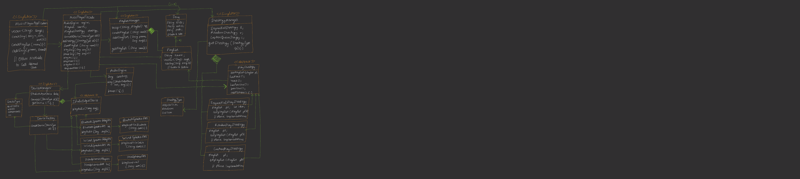

# Spotify LLD — Music Player System (Low-Level Design, C++)

A Low-Level Design (LLD) implementation of a Spotify-style music
player, built to demonstrate clean object-oriented design: five
classic Gang-of-Four design patterns applied to a real, runnable
problem — not described in the abstract, but actually wired together
and executable.


*(hand-drawn design diagram, sketched before implementation — the
actual class structure below matches it exactly)*

---

## What is this?

A console application that models the core of a music streaming
player:
- a song library and playlists,
- multiple playback strategies (sequential, random/shuffle, and a
  custom "play next" queue),
- multiple output devices (Bluetooth, wired speaker, headphones) that
  each wrap a *different, incompatible* external vendor API,
- a single simple `MusicPlayerApplication` interface that hides all of
  that complexity from the caller.

Run it and it plays through a demo playlist under all three playback
strategies, connects and switches between output devices, and
demonstrates play/pause/resume — entirely in the terminal, no actual
audio hardware required (the "external" vendor APIs just print what
they'd send to the device).

## Why this project is useful (what it actually demonstrates)

This is an LLD (Low-Level Design) exercise — the kind directly asked
in machine-coding/design rounds at most product-based MNCs (Amazon,
Flipkart, Uber-style interviews, and the "LLD round" that's now
standard at many mid-to-large tech companies). It deliberately uses
**five design patterns together, each solving a real problem** rather
than being bolted on for demonstration's sake:

| Pattern | Where | Problem it solves here |
|---|---|---|
| **Singleton** | `MusicPlayerApplication`, `MusicPlayerFacade`, `DeviceManager`, `PlaylistManager`, `StrategyManager` | Exactly one song library, one connected device, one set of playlists should exist app-wide — not re-created per call. |
| **Facade** | `MusicPlayerFacade` | The application layer shouldn't need to know about `AudioEngine`, `DeviceManager`, and `PlayStrategy` separately and coordinate them itself — the facade hides that orchestration behind `playSong()`, `loadPlaylist()`, etc. |
| **Strategy** | `PlayStrategy` + `SequentialPlayStrategy` / `RandomPlayStrategy` / `CustomQueueStrategy` | Playback order needs to be swappable at runtime without `if/else`-ing on a mode flag everywhere playback happens. |
| **Adapter** | `IAudioOutputDevice` + `BluetoothSpeakerAdapter` / `WiredSpeakerAdapter` / `HeadphonesAdapter` | Each output device's real-world SDK (`BluetoothSpeakerAPI`, `WiredSpeakerAPI`, `HeadphonesAPI`) has a different, incompatible method signature — the adapters translate all three to one common `playAudio()` interface. |
| **Factory** | `DeviceFactory` | Device construction logic (which adapter wraps which vendor API) is centralized in one place instead of scattered across every call site that needs a device. |

**Why this matters beyond "it's a resume project":** the same
structure — a facade over multiple subsystems, a swappable strategy,
an adapter layer over inconsistent third-party SDKs, and a factory to
centralize object creation — is exactly what shows up in real backend
systems integrating multiple payment gateways, multiple cloud storage
providers, or multiple notification channels (SMS/email/push) behind
one clean interface. Being able to defend *why* each pattern was
chosen here (not just name it) is what an LLD interview round is
actually evaluating.

## How to use it

### 1. Prerequisites
- Any C++17 compiler (g++, clang++)
- CMake ≥ 3.10 (optional — a single `g++` command also works, see below)

### 2. Build & run — quick way (no CMake)
```bash
git clone https://github.com/Kuldeepcoder2006/SpotifyLLD.git
cd SpotifyLLD/MusicPlayerApp
g++ -std=c++17 -Wall main.cpp -o music_player
./music_player
```

### 3. Build & run — with CMake
```bash
cd SpotifyLLD
mkdir build && cd build
cmake ..
make
./music_player
```

### 4. What you'll see
The demo in `main.cpp` populates a small Bollywood playlist, connects
a Bluetooth device, then runs through:
```
-- Sequential Playback --
Playing song: Kesariya
[BluetoothSpeaker] Playing: Kesariya by Arijit Singh
...
-- Random Playback --
...
-- Custom Queue Playback --
...
-- Play Previous in Sequential --
...
```
Read `main.cpp` top-to-bottom alongside the output — it's written as
a walkthrough of every feature (library management, playlists, device
switching, play/pause/resume, all three strategies, previous-track
navigation).

### 5. Extending it (good exercises if you want to build on this)
- Add a new output device (e.g. `CarSpeakerAdapter`) — touch only
  `device/`, `external/`, `enums/DeviceType.hpp`, and one line in
  `DeviceFactory` — nothing else in the codebase should need to change.
  That "closed for modification, open for extension" property is the
  Open/Closed Principle in action, and it's a direct consequence of
  the Adapter + Factory combination above.
- Add a `RepeatOnePlayStrategy` the same way — implement
  `PlayStrategy`, register it in `StrategyManager`, done.
- Swap `PlaylistManager`'s `map<string, Playlist*>` for persistent
  storage (SQLite) without touching `MusicPlayerFacade` at all — the
  facade only depends on `PlaylistManager`'s interface, not its
  internals.

## Repo structure
```
MusicPlayerApp/
├── main.cpp                       - composition root / demo entry point
├── MusicPlayerApplication.hpp     - top-level Singleton app interface
├── MusicPlayerFacade.hpp          - Facade orchestrating engine/device/strategy
├── core/
│   └── AudioEngine.hpp            - actual play/pause state machine
├── enums/
│   ├── DeviceType.hpp
│   └── PlayStrategyType.hpp
├── models/
│   ├── Song.hpp
│   └── Playlist.hpp
├── managers/                      - Singleton managers (device/playlist/strategy)
│   ├── DeviceManager.hpp
│   ├── PlaylistManager.hpp
│   └── StrategyManager.hpp
├── strategies/                    - Strategy pattern: playback order
│   ├── PlayStrategy.hpp
│   ├── SequentialPlayStrategy.hpp
│   ├── RandomPlayStrategy.hpp
│   └── CustomQueueStrategy.hpp
├── device/                        - Adapter pattern: common device interface
│   ├── IAudioOutputDevice.hpp
│   ├── BluetoothSpeakerAdapter.hpp
│   ├── WiredSpeakerAdapter.hpp
│   └── HeadphonesAdapter.hpp
├── external/                      - simulated 3rd-party vendor SDKs (the
│   ├── BluetoothSpeakerAPI.hpp    -  "incompatible interfaces" the
│   ├── HeadphonesAPI.hpp          -  adapters above translate)
│   └── WiredSpeakerAPI.hpp
└── factories/
    └── DeviceFactory.hpp          - Factory pattern: centralized device creation

diagrams/
└── uml-class-diagram.png          - the original design sketch
```

## Design notes / known simplifications
- **Raw pointers, no cleanup.** This is an LLD/interview-style
  exercise focused on structure and pattern usage, so object lifetime
  management (smart pointers, explicit destructors) was intentionally
  left out to keep the pattern code readable. A production version
  would use `unique_ptr`/`shared_ptr` throughout.
- **No thread safety.** The Singletons here aren't safe for concurrent
  first-access from multiple threads (classic double-checked-locking
  territory). Worth mentioning proactively if asked "would this work
  in a multithreaded app?" in an interview — a great follow-up
  question to have a ready answer for.
- **In-memory only.** No persistence layer; playlists and the song
  library reset on every run by design, since this is a design-pattern
  showcase, not a shippable app.
